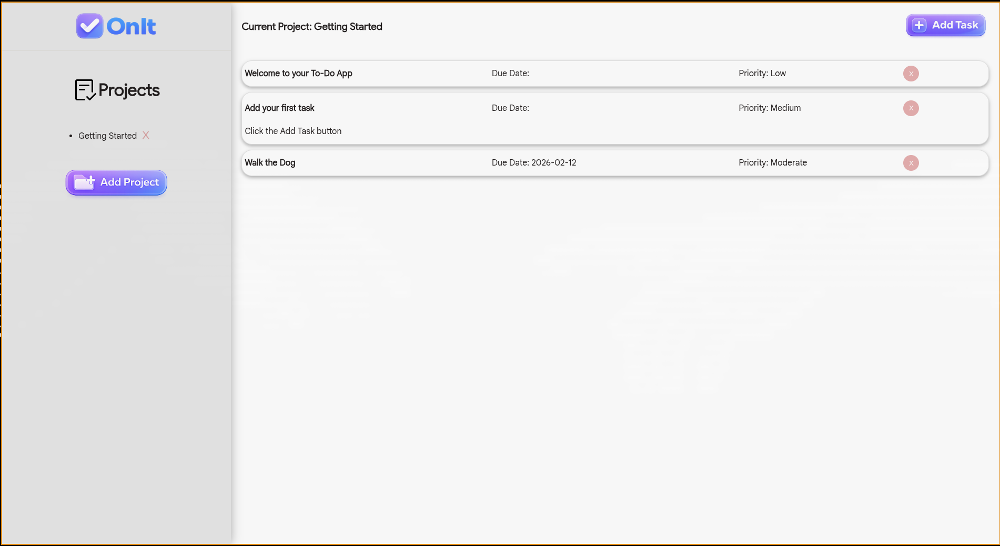
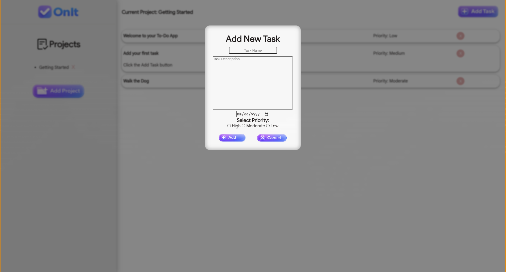

  

  

<h3 align="center">To Do List</h3>

   

---

 A simple to do list made as a project. Tasks are saved in indvidual projects that can be accessed through local storage.
      

## 📝 Table of Contents
-[About](#about)

-[Deployment](#deployment)

-[Built Using](#built_using)

## 🧐 About 
This project is a to-do list application that allows users to organize tasks into separate projects, making it easier to keep different types of work organized in one place. Each project contains its own set of tasks, and all project data is saved locally so users can close the app and return later without losing their progress. The goal was to create a simple but flexible system that feels intuitive while still being structured under the hood.

While building this project, I learned how to save and load data using local storage in the browser. I worked with JSON by stringifying JavaScript objects before saving them and parsing that data back into usable objects when the app loads. This project helped me better understand how to manage application state, persist data across sessions, and structure data in a way that scales as features are added.

## 🚀 Deployment 
Deployment is simple! [Click Here](https://wlewis0991.github.io/ToDo/)

## ⛏️ Built Using 

